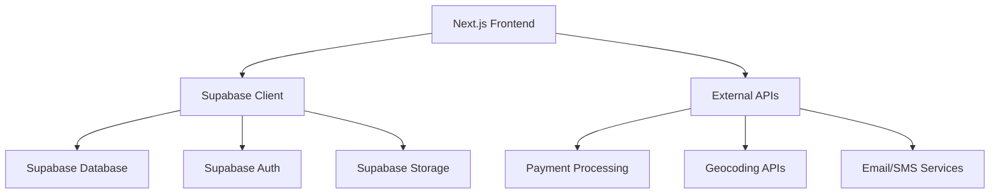

# Design Document

## Overview

RentPal is a modern peer-to-peer rental marketplace web application built with Next.js and Supabase backend. The system follows a component-based architecture with clear separation between presentation, business logic, and data layers. The application will be responsive, performant, and scalable to handle thousands of users listing and renting various items from tools to vehicles.

## Architecture

### High-Level Architecture



### Technology Stack

- **Frontend**: Next.js 13+ with App Router, React 18+, TypeScript, Tailwind CSS
- **Backend**: Supabase (PostgreSQL database, authentication, real-time subscriptions, file storage)
- **State Management**: React Context API with useReducer for complex state, SWR for data fetching
- **Routing**: Next.js App Router
- **Forms**: React Hook Form with Zod validation
- **Payments**: Stripe integration for secure payment processing
- **Image Management**: Supabase Storage for image uploads and optimization
- **Maps**: Google Maps API or Mapbox for location services
- **Notifications**: Email via Supabase Edge Functions, push notifications

## Components and Interfaces

### Core Components

#### 1. Authentication Components
- `LoginForm`: Handles user login with Supabase Auth
- `RegisterForm`: User registration with email verification
- `PasswordReset`: Password reset functionality
- `AuthGuard`: Route protection component
- `ProfileSetup`: Initial profile completion after registration

#### 2. Item Management Components
- `ItemForm`: Add/edit item listings with validation
- `ItemCard`: Display item summary in search results and lists
- `ItemDetails`: Detailed item view with images, pricing, and availability
- `ItemSearch`: Advanced search and filter functionality
- `ImageUpload`: Handle multiple item image uploads to Supabase Storage
- `AvailabilityCalendar`: Manage item availability and booking calendar

#### 3. Booking and Payment Components
- `BookingForm`: Date selection and booking request form
- `PaymentProcessor`: Stripe integration for secure payments
- `BookingConfirmation`: Booking details and confirmation
- `BookingManagement`: View and manage active bookings
- `RefundProcessor`: Handle refund requests and processing

#### 4. Dashboard Components
- `UserDashboard`: Main dashboard with user's listings and bookings
- `ListingManagement`: Manage user's item listings
- `BookingHistory`: View past and current bookings
- `EarningsOverview`: Track rental income and payouts
- `NotificationCenter`: In-app notifications and alerts

#### 5. Communication Components
- `MessageThread`: Real-time messaging between users
- `ConversationList`: List of active conversations
- `NotificationSystem`: Push and email notifications
- `ContactInfo`: Secure contact information sharing

### Data Models

#### User Profile
```typescript
interface UserProfile {
  id: string;
  email: string;
  full_name: string;
  avatar_url?: string;
  phone?: string;
  address: string;
  city: string;
  state: string;
  zip_code: string;
  latitude?: number;
  longitude?: number;
  bio?: string;
  verification_status: 'pending' | 'verified' | 'rejected';
  rating: number;
  total_reviews: number;
  created_at: string;
  updated_at: string;
}
```

#### Item Listing
```typescript
interface ItemListing {
  id: string;
  owner_id: string;
  title: string;
  description: string;
  category: string;
  subcategory?: string;
  condition: 'new' | 'like_new' | 'good' | 'fair' | 'poor';
  daily_rate: number;
  hourly_rate?: number;
  security_deposit?: number;
  images: string[];
  location: {
    address: string;
    city: string;
    state: string;
    zip_code: string;
    latitude: number;
    longitude: number;
  };
  availability: {
    available_from: string;
    available_until?: string;
    blocked_dates: string[];
    minimum_rental_period: number; // in hours
    maximum_rental_period?: number; // in hours
  };
  policies: {
    cancellation_policy: 'flexible' | 'moderate' | 'strict';
    pickup_delivery: 'pickup_only' | 'delivery_available' | 'both';
    delivery_fee?: number;
    delivery_radius?: number; // in miles
  };
  status: 'active' | 'inactive' | 'rented' | 'maintenance';
  created_at: string;
  updated_at: string;
}
```

#### Booking
```typescript
interface Booking {
  id: string;
  item_id: string;
  renter_id: string;
  owner_id: string;
  start_date: string;
  end_date: string;
  total_hours: number;
  pricing: {
    base_cost: number;
    security_deposit: number;
    delivery_fee?: number;
    service_fee: number;
    total_amount: number;
  };
  status: 'pending' | 'confirmed' | 'active' | 'completed' | 'cancelled' | 'disputed';
  payment_status: 'pending' | 'paid' | 'refunded' | 'partially_refunded';
  pickup_delivery: {
    method: 'pickup' | 'delivery';
    address?: string;
    scheduled_time?: string;
    completed_time?: string;
  };
  created_at: string;
  updated_at: string;
}
```

#### Review
```typescript
interface Review {
  id: string;
  booking_id: string;
  reviewer_id: string;
  reviewee_id: string;
  item_id?: string;
  rating: number; // 1-5
  comment?: string;
  review_type: 'renter_to_owner' | 'owner_to_renter' | 'item_review';
  created_at: string;
}
```

#### Message
```typescript
interface Message {
  id: string;
  conversation_id: string;
  sender_id: string;
  recipient_id: string;
  content: string;
  message_type: 'text' | 'image' | 'location' | 'system';
  read_at?: string;
  created_at: string;
}
```

#### Category
```typescript
interface Category {
  id: string;
  name: string;
  slug: string;
  description?: string;
  icon?: string;
  parent_category_id?: string;
  subcategories?: Category[];
  item_count: number;
  created_at: string;
}
```

### Database Schema

#### Supabase Tables

1. **profiles** - User profile information and verification status
2. **item_listings** - Item details, pricing, and availability
3. **bookings** - Rental bookings and transaction records
4. **reviews** - User and item reviews and ratings
5. **messages** - In-app messaging system
6. **conversations** - Message thread management
7. **categories** - Item categories and subcategories
8. **favorites** - User's saved/favorited items
9. **notifications** - System notifications and alerts
10. **payment_methods** - User payment information (tokenized)
11. **payouts** - Owner earnings and payout records

#### Row Level Security (RLS) Policies

- Users can only access their own profile, bookings, and messages
- Public read access for item listings and categories
- Item owners can manage their own listings
- Booking participants can access booking details
- Reviews are publicly readable but only writable by booking participants
- Messages are only accessible to conversation participants

## Error Handling

### Frontend Error Handling
- Global error boundary for React component errors
- Form validation with user-friendly error messages
- Network error handling with retry mechanisms
- Loading states and skeleton screens for better UX
- Payment error handling with clear user guidance
- Image upload error handling with progress indicators

### Backend Error Handling
- Supabase client error handling for database operations
- Authentication error handling with appropriate redirects
- Payment processing error handling and rollback mechanisms
- File upload error handling with cleanup procedures
- Real-time subscription error handling and reconnection

### Error Types
```typescript
interface AppError {
  type: 'validation' | 'network' | 'auth' | 'database' | 'payment' | 'upload' | 'booking';
  message: string;
  details?: any;
  timestamp: string;
  user_action?: string; // Suggested action for user
}
```

## Testing Strategy

### Unit Testing
- Component testing with React Testing Library
- Utility function testing for pricing calculations and date handling
- Custom hook testing for data fetching and real-time updates
- Form validation testing for item listings and bookings

### Integration Testing
- Supabase client integration tests
- Authentication flow testing
- Payment processing integration tests
- File upload and storage testing
- Real-time messaging functionality
- End-to-end booking workflow testing

### Test Data Management
- Mock data generators for users, items, and bookings
- Test database seeding scripts with realistic data
- Isolated test environments for different scenarios
- Payment testing with Stripe test mode

### Performance Testing
- Component rendering performance with large item catalogs
- Search and filtering performance with thousands of items
- Image loading and optimization testing
- Real-time messaging performance under load
- Database query performance optimization

## Security Considerations

### Authentication & Authorization
- Supabase Auth with email verification and optional phone verification
- JWT token management and refresh
- Role-based access control for admin functions
- Secure password requirements and account lockout policies

### Data Protection
- Row Level Security (RLS) in Supabase for all sensitive data
- Input sanitization and validation for all user inputs
- Secure file upload handling with virus scanning
- HTTPS enforcement and secure headers
- PCI compliance for payment processing

### Privacy & Trust
- User data encryption at rest and in transit
- Secure image storage with access controls
- Data retention and deletion policies
- GDPR compliance and user data export
- Identity verification system for high-value items
- Background checks for certain item categories

### Financial Security
- Secure payment processing with Stripe
- Escrow system for holding payments until rental completion
- Fraud detection and prevention
- Secure payout processing
- Transaction monitoring and suspicious activity detection

## Performance Optimization

### Frontend Optimization
- Next.js App Router with server-side rendering
- Code splitting and lazy loading for better initial load times
- Image optimization with Next.js Image component
- Memoization of expensive calculations and API calls
- Virtual scrolling for large item catalogs
- Progressive Web App (PWA) capabilities

### Backend Optimization
- Database indexing for search queries and common filters
- Caching of frequently accessed data (categories, popular items)
- Optimized image storage and delivery with CDN
- Connection pooling and query optimization
- Real-time subscriptions optimization for messaging

### Monitoring & Analytics
- Error tracking and logging with detailed context
- Performance metrics collection and alerting
- User analytics and conversion tracking
- Database performance monitoring
- Payment processing monitoring
- Real-time system health dashboards