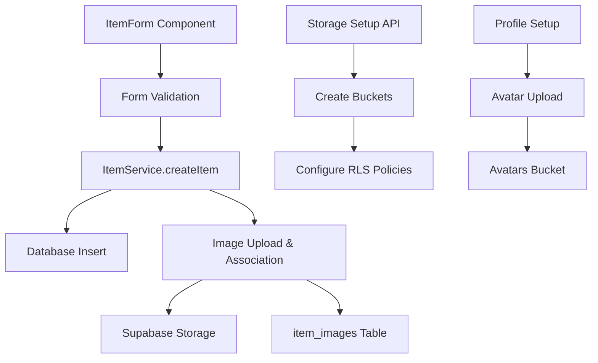

# Design Document

## Overview

This design addresses the critical issues with item creation functionality and establishes a robust Supabase storage system for handling images. The current implementation has several problems: the ItemForm component has debugging code that bypasses the itemService, the createItem method doesn't handle image associations, and storage buckets may not be properly configured with security policies.

The solution involves fixing the item creation flow, ensuring proper Supabase bucket configuration with RLS policies, and implementing reliable image upload and association mechanisms.

## Architecture

### Current System Issues

1. **ItemForm Component**: Contains debugging code that bypasses itemService and attempts direct database insertion
2. **ItemService**: The `createItem` method only accepts `ItemInsert` but the form tries to pass images as a second parameter
3. **Storage Buckets**: May not exist or lack proper security policies
4. **Image Association**: No mechanism to link uploaded images to items during creation

### Proposed Architecture



## Components and Interfaces

### 1. Storage Configuration Service

**Purpose**: Ensure Supabase buckets exist with proper configuration

**Interface**:
```typescript
interface StorageSetupResult {
  success: boolean
  message: string
  results: BucketResult[]
}

interface BucketResult {
  name: string
  status: 'created' | 'exists' | 'error'
  error?: string
}
```

**Implementation**: Enhance existing `/api/setup-storage` route to include RLS policy creation

### 2. Enhanced ItemService

**Purpose**: Handle complete item creation including image associations

**Interface**:
```typescript
interface CreateItemParams {
  itemData: ItemInsert
  images?: File[] | string[]
}

interface CreateItemResult {
  success: boolean
  data?: Item
  error?: string
}
```

**Methods**:
- `createItem(params: CreateItemParams): Promise<CreateItemResult>`
- `uploadItemImages(itemId: string, images: File[]): Promise<string[]>`
- `associateImages(itemId: string, imageUrls: string[]): Promise<void>`

### 3. Fixed ItemForm Component

**Purpose**: Provide reliable item creation with proper error handling

**Key Changes**:
- Remove debugging code and direct database calls
- Use enhanced itemService.createItem method
- Implement proper error handling and user feedback
- Add profile validation before item creation

### 4. Image Upload Components

**Purpose**: Handle file uploads to appropriate Supabase buckets

**Components**:
- `ItemImageUpload`: For multiple item images
- `ProfileImageUpload`: For single profile avatar

**Interface**:
```typescript
interface ImageUploadProps {
  bucket: 'item-images' | 'avatars'
  maxFiles?: number
  maxSize?: number
  onUpload: (urls: string[]) => void
  onError: (error: string) => void
}
```

## Data Models

### Storage Buckets Configuration

```typescript
const BUCKET_CONFIG = {
  'item-images': {
    public: true,
    allowedMimeTypes: ['image/jpeg', 'image/png', 'image/webp'],
    fileSizeLimit: 5 * 1024 * 1024, // 5MB
    maxFiles: 10
  },
  'avatars': {
    public: true,
    allowedMimeTypes: ['image/jpeg', 'image/png', 'image/webp'],
    fileSizeLimit: 2 * 1024 * 1024, // 2MB
    maxFiles: 1
  }
}
```

### RLS Policies

**item-images bucket**:
- Public read access for all users
- Authenticated users can upload to their own folder structure
- Users can delete their own images

**avatars bucket**:
- Public read access for all users
- Authenticated users can upload/update their own avatar
- Users can delete their own avatar

### Database Schema Updates

**item_images table** (if not exists):
```sql
CREATE TABLE item_images (
  id UUID PRIMARY KEY DEFAULT gen_random_uuid(),
  item_id UUID REFERENCES items(id) ON DELETE CASCADE,
  image_url TEXT NOT NULL,
  display_order INTEGER DEFAULT 0,
  created_at TIMESTAMP WITH TIME ZONE DEFAULT NOW()
);
```

## Error Handling

### Form Validation Errors
- Client-side validation using react-hook-form and zod
- Real-time field validation with clear error messages
- Form-level validation before submission

### API Error Handling
- Structured error responses with specific error codes
- User-friendly error messages for common scenarios
- Detailed logging for debugging purposes

### Storage Error Handling
- File size and type validation before upload
- Retry logic for failed uploads
- Cleanup of partially uploaded files
- Graceful degradation when storage is unavailable

### Database Error Handling
- Transaction rollback for failed item creation
- Orphaned image cleanup
- Constraint violation handling
- Connection error recovery

## Testing Strategy

### Unit Tests
- ItemService methods with mocked Supabase client
- Form validation logic
- Image upload utilities
- Error handling scenarios

### Integration Tests
- Complete item creation flow
- Image upload and association
- Storage bucket operations
- RLS policy enforcement

### End-to-End Tests
- User creates item with images successfully
- Error scenarios (invalid data, storage failures)
- Profile setup flow
- Image management (upload, delete, replace)

### Manual Testing Scenarios
1. **Happy Path**: User creates item with multiple images
2. **No Profile**: User without profile attempts item creation
3. **Storage Failure**: Network issues during image upload
4. **Large Files**: Upload files exceeding size limits
5. **Invalid Files**: Upload non-image files
6. **Bucket Missing**: Storage buckets not configured

## Security Considerations

### Authentication
- All item creation requires authenticated user
- Profile validation before allowing item creation
- User can only modify their own items and images

### File Upload Security
- MIME type validation on client and server
- File size limits enforced
- Malicious file detection
- Secure file naming to prevent path traversal

### RLS Policies
- Users can only access their own uploaded images for modification
- Public read access for displaying images
- Prevent unauthorized bucket access

### Data Validation
- Server-side validation of all form data
- SQL injection prevention through parameterized queries
- XSS prevention in user-generated content

## Performance Considerations

### Image Optimization
- Client-side image compression before upload
- Progressive image loading in UI
- Thumbnail generation for list views
- CDN integration for faster delivery

### Database Optimization
- Proper indexing on frequently queried fields
- Efficient image association queries
- Connection pooling for high concurrency

### Caching Strategy
- Cache item data with images
- Invalidate cache on item updates
- Browser caching for static images
- Memory caching for frequently accessed data

## Deployment Considerations

### Environment Configuration
- Supabase URL and keys properly configured
- Storage bucket permissions set correctly
- RLS policies deployed to production
- Environment-specific file size limits

### Migration Strategy
- Run storage setup API to create buckets
- Deploy RLS policies before enabling features
- Migrate existing items to use new image system
- Gradual rollout with feature flags

### Monitoring
- Track item creation success rates
- Monitor storage usage and costs
- Alert on high error rates
- Performance metrics for image uploads